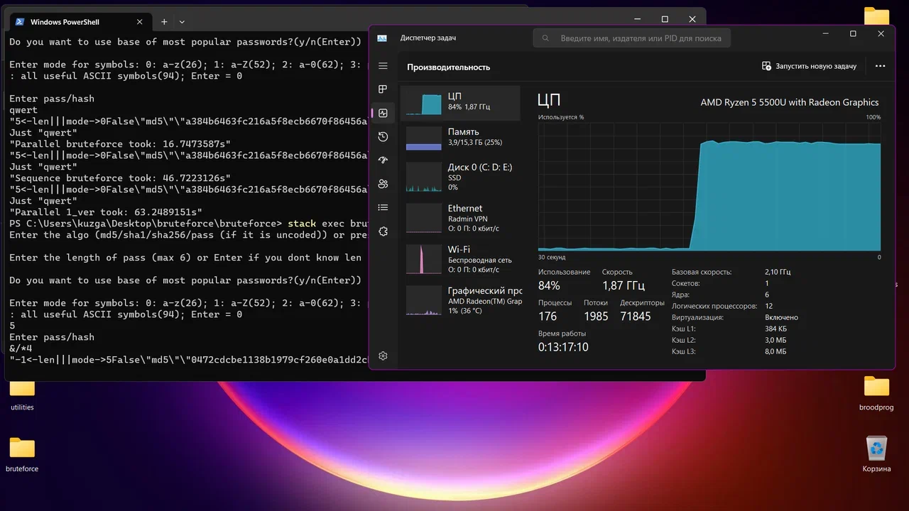
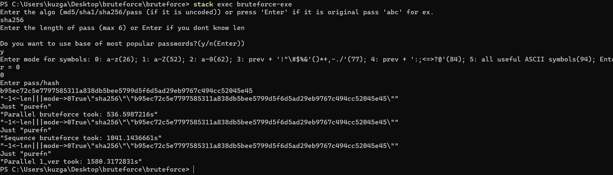
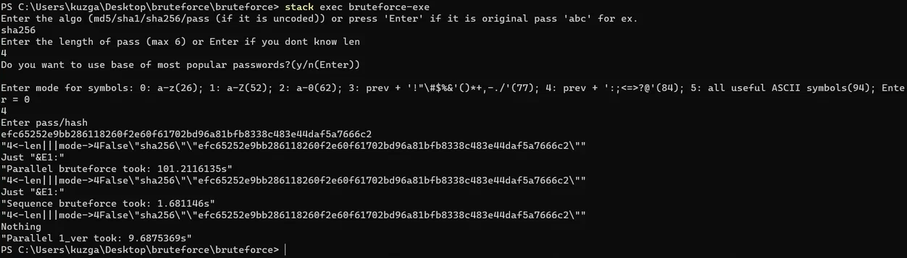
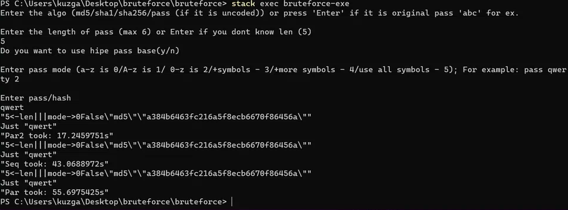

This is a brute force application written in Haskell. You just run the exe, choose the type of hash that you have, the minimum length of the original password if you know it, the set of characters that make up the password if you know it and use the database of popular passwords or not (it contains about one hundred thousand of the most popular passwords)

